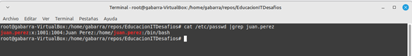
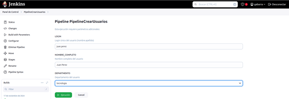
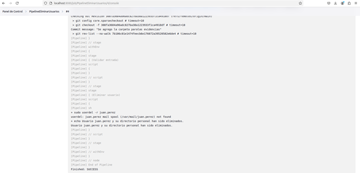
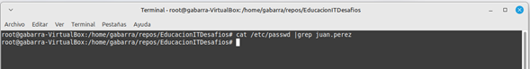
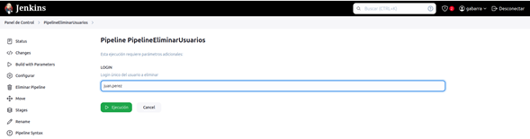

# 🚀 **Automatización de Gestión de Usuarios en Linux con Jenkins**

## 📋 Descripción del Proyecto

*Este proyecto implementa pipelines en Jenkins para automatizar la gestión de usuarios en sistemas Linux. Proporciona dos funcionalidades principales:*

## **Creación de usuarios:**

- *Automatiza la creación de usuarios con parámetros personalizados.*
- *Asigna un grupo, un shell y genera una contraseña temporal.*

## **Eliminación de usuarios:**

- *Permite eliminar usuarios existentes junto con sus directorios personales y grupos.*

## **Objetivo**
*Simplificar la administración de usuarios y minimizar errores operativos mediante una herramienta confiable y reproducible.*

## ✨ **Características**
 * ✔️ *Gestión automatizada de usuarios (creación y eliminación).*
 * ✔️ *Personalización mediante parámetros como login, nombre completo y departamento.*
 * ✔️ *Compatible con cualquier sistema Linux.*
 * ✔️ *Fácil integración con Jenkins.*

## 🛠️ Requisitos Previos
### 1. Requisitos del Servidor
* **Sistema Operativo:**  ***Linux (Ubuntu, Debian, etc.).***
* **Permisos:**  ***Acceso como usuario sudo para ejecutar comandos administrativos.***

* **Jenkins:**
***Instalado y configurado en el servidor.***
* **Plugins requeridos:**
***Pipeline***
***Git Plugin***

* **Paquetes necesarios en el servidor:**
***useradd (instalado por defecto).***
***git para clonar el repositorio.***

### 2. Repositorio de GitHub
Clona este repositorio en Jenkins:
***https://github.com/gaboibarra/EducacionITDesafios.git***

## ⚙️ Configuración del Proyecto en Jenkins
### 1. Pipeline de Creación de Usuarios
***Pasos para Configurar***
* **En Jenkins Crear un nuevo pipeline:**
* **Nombre:** PipelineCrearUsuarios.
* Configura el pipeline seleccionando: **Pipeline script from SCM.**
Completa los campos:
* **SCM:** Git.
* **Repository URL:** https://github.com/gaboibarra/EducacionITDesafios.git.
* **Script Path:** pipelines/create-user.groovy.
* **Guarda los cambios.**

## 👥 Gestión de Grupos en el Sistema

### ¿Qué son los Grupos en Linux?
Los grupos son una forma de organizar usuarios en el sistema Linux. Permiten aplicar permisos compartidos y organizar mejor la administración de usuarios.

## Grupos utilizados en este proyecto
En este proyecto, los siguientes grupos representan los departamentos:
* contabilidad
* finanzas
* tecnologia
  
Estos grupos deben existir en el sistema antes de ejecutar los pipelines.

### Creación de Grupos en el Sistema
Si no existen, los grupos se pueden crear con el siguiente comando:

* sudo groupadd contabilidad
* sudo groupadd finanzas
* sudo groupadd tecnologia

### Validación de Grupos
Para verificar los grupos existentes:

* getent group
### Ejemplo de salida esperada:

* contabilidad:x:1001:
* finanzas:x:1002:
* tecnologia:x:1003:

## Ejecucion
Al ejecutar el pipeline, se te pedirá ingresar los siguientes parámetros:

* **LOGIN:** Nombre único del usuario (formato nombre.apellido).
* **NOMBRE_COMPLETO:** Nombre completo del usuario.
* **DEPARTAMENTO:** Departamento del usuario (opciones: contabilidad, finanzas, tecnologia).

| Parámetro       | Descripción                 | Ejemplo        |
|-----------------|-----------------------------|----------------|
| `LOGIN`         | Nombre único del usuario    | juan.perez     |
| `NOMBRE_COMPLETO` | Nombre completo del usuario | Juan Pérez     |
| `DEPARTAMENTO`  | Grupo al que pertenece      | tecnologia     |

### Resultado esperado
* Se crea el usuario juan.perez con un directorio personal /home/juan.perez.
* Se asigna al grupo tecnologia.
* Se genera una contraseña temporal.

### 2. Pipeline de Eliminación de Usuarios
***Pasos para Configurar***
* **En Jenkins Crear un nuevo pipeline:**
* **Nombre:** PipelineEliminarUsuarios.
* Configura el pipeline seleccionando: **Pipeline script from SCM.**
Completa los campos:
* **SCM:** Git.
* **Repository URL:** https://github.com/gaboibarra/EducacionITDesafios.git.
* **Script Path:** pipelines/delete-user.groovy.
* **Guarda los cambios.**

## Ejecucion
Al ejecutar el pipeline, se te pedirá ingresar los siguientes parámetros:

* **LOGIN:** Nombre único del usuario (formato nombre.apellido).

| Parámetro       | Descripción                 | Ejemplo        |
|-----------------|-----------------------------|----------------|
| `LOGIN`         | Nombre único del usuario    | juan.perez     |

### Resultado esperado
* Se elimina el usuario juan.perez del sistema
* Se elimina el directorio personal del usuario

## 📂 Evidencias
### **PipelineCrearUsuarios**
1. **Ejecución Exitosa con Parámetros**
   

2. **Validación de Usuario Creado en el Sistema**
  * 

3. **Pipeline Configurado**
   

---

### **PipelineEliminarUsuarios**
1. **Ejecución Exitosa con Parámetros**
   

2. **Validación de Usuario Eliminado en el Sistema**
   

3. **Pipeline Configurado**
   

---

### **Capturas de Configuración General**
1. **Todos los Pipelines Configurados**
   

---

### **Logs de Salida**
- [Salida del Pipeline Crear Usuario](evidencias/salida_pipeline_crear_usuario.txt.txt)  
- [Salida del Pipeline Eliminar Usuario](evidencias/salida_pipeline_eliminar_usuario.txt.txt)

## 💡 Notas Finales
### Limitaciones
* Actualmente, no incluye validaciones avanzadas para evitar duplicados en nombres de usuarios.
* El correo electrónico no está integrado en esta versión.
  
### Mejoras Futuras
* Agregar notificaciones automáticas al administrador.
* Incluir un pipeline para listar usuarios existentes en el sistema.

🏆 Autores
* [Gabriel Ibarra](https://github.com/gaboibarra)

  
